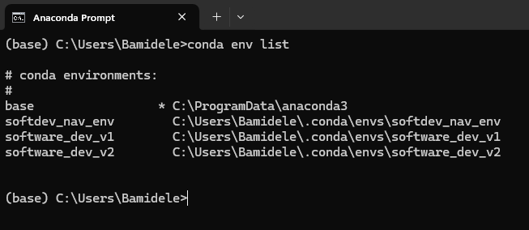

A2: Conda Environment Setup from YAML files

1.  Software_dev_v1: I was able to recreate the environment successfully
    without any error using the ***conda env create -f
    environment.yml*** command.

{width="4.0625in" height="3.4615649606299215in"}

Here is a list of packages in the environment

{width="4.119676290463692in"
height="2.4508300524934383in"}

{\...}

{width="4.126161417322835in"
height="1.8171391076115486in"}

2.  Software_dev_v2: Similarly, I was able to recreate the environment
    successfully without any error.

{width="4.124271653543307in"
height="2.6218777340332458in"}

Here is a list of packages in the environment:

{width="4.124560367454068in"
height="3.2266207349081366in"}

{ \... }

{width="4.168047900262467in"
height="1.9505697725284339in"}

Here is a list of all environments on my machine. Although I had ArcGIS
Pro installed, I decided to install Miniconda separately to experiment.

{width="4.167031933508311in"
height="1.8123075240594926in"}
